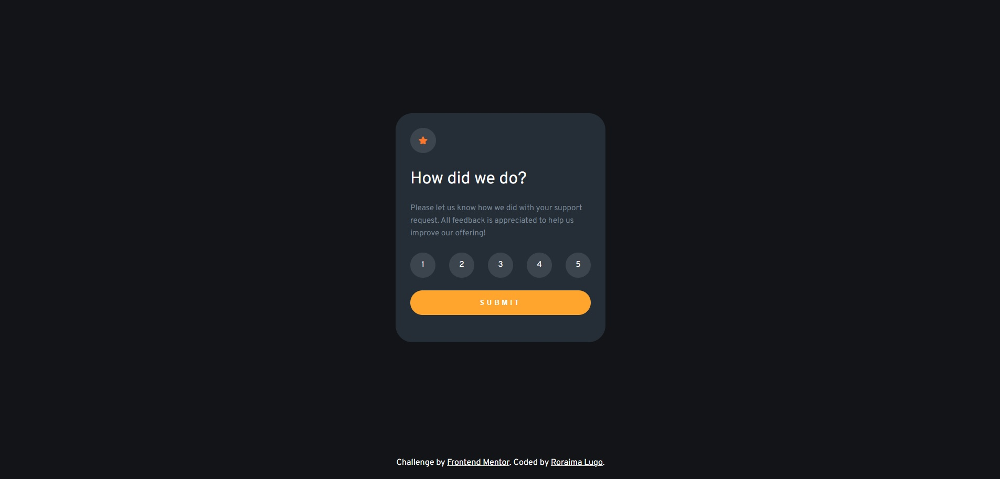

# Frontend Mentor - Interactive rating component

## Overview

### Screenshot

## My process

### Built with

- Semantic HTML5 markup
- CSS custom properties
- Flexbox
- Sass
- JavaScript

## Author

- Website - [https://roraima1986.github.io/interactive-rating.github.io/](https://roraima1986.github.io/interactive-rating.github.io/)
- Frontend Mentor - [@roraima1986](https://www.frontendmentor.io/profile/roraima1986)
